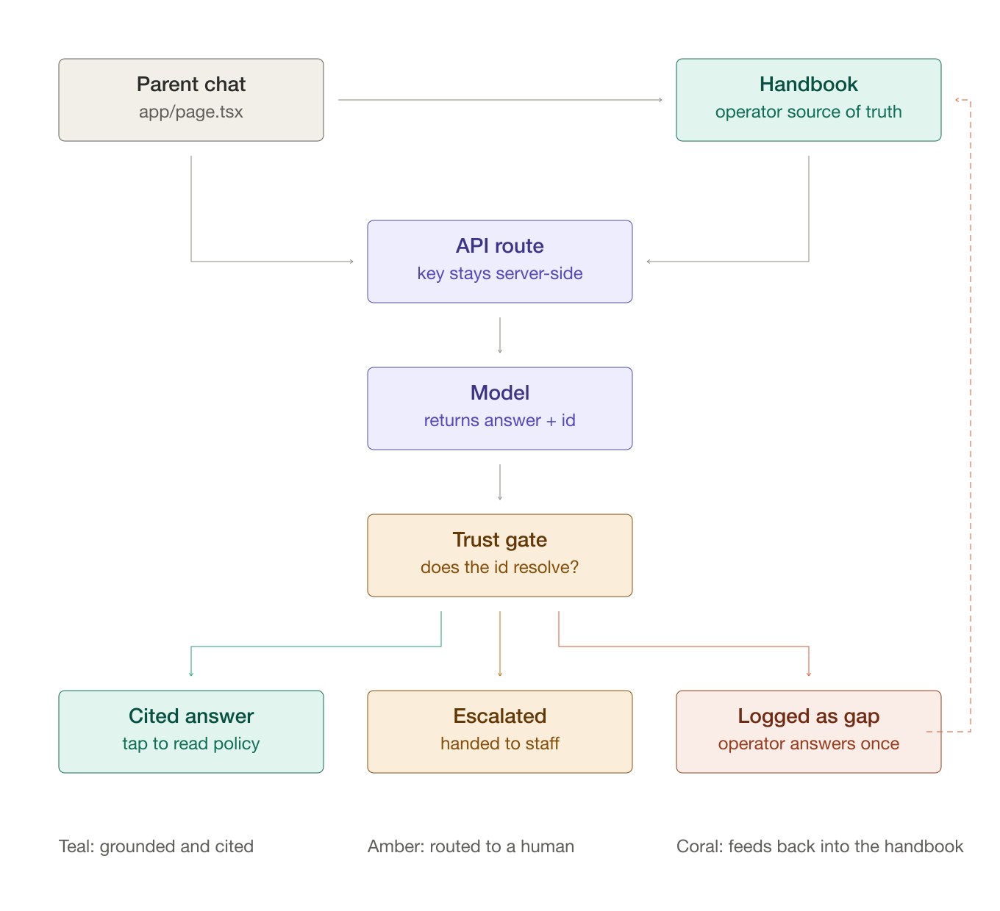

# AI Front Desk for Sunny Sprouts Learning Center

A prototype AI front desk for a daycare. Parents ask questions and get answers grounded in the center's own written policies; staff manage that source of truth and see what the front desk could not answer.

Two views: `/` for parents, `/admin` for staff.

## Architecture



A question travels from the chat page to a Next.js API route, which sends the operator-managed knowledge base to the model. The model returns an answer plus the `id` of the entry it claims to have used.

**The trust gate is the point of the whole design.** The server checks that claimed `id` against the real knowledge base before anything reaches the parent, which produces three outcomes:

| Outcome | When | What the parent sees |
| --- | --- | --- |
| Cited answer | The id resolves to a real entry | The answer plus a chip that expands the verbatim policy |
| Escalated | Judgment about a specific child, billing, custody, safety | A card naming the director, with a tappable phone number |
| Logged as gap | No entry covers the question | An honest "I don't have that on file", never a guess |

A `sourceId` the model invents that does not match a real entry is dropped rather than trusted, and confidence is downgraded to low. A fabricated citation would be worse than no citation, since the entire value of the chip is that a parent can verify it.

The dashed line back to the knowledge base is the improvement loop: a gap becomes a one-click "Answer this" in the dashboard, and the front desk handles that question from then on.

## Running it

```bash
npm install
```

Add an OpenAI key (it is only ever read server-side, and `.env*` is gitignored):

```bash
echo 'OPENAI_API_KEY=sk-...' > .env.local
```

```bash
npm run dev
```

Without a key the app still runs. Every request degrades to the same warm "call the center" escalation rather than an error.

## Layout

```
app/
  page.tsx            parent chat
  admin/page.tsx      operator control center
  api/chat/route.ts   grounding, escalation rules, citation validation
lib/
  seed.ts             the fictional center's policies
  store.ts            localStorage persistence for edits and the question log
  types.ts
docs/
  architecture.svg    source for the diagram above
```

## Scope notes

Knowledge lives in seed JSON; operator edits and the question log persist in `localStorage`. That is deliberate for a prototype, since the demo is instant and has no infrastructure to stand up, but data is per-browser. `lib/store.ts` is a single module with a narrow interface, so swapping in a real database is a contained change.

Answers are grounded by putting the full knowledge base in the prompt. That is the right call at ten entries and the wrong one at five hundred; a real center would need retrieval over the handbook and per-center answer evals to catch regressions when a policy changes.

See [SUBMISSION.md](SUBMISSION.md) for the design rationale.
